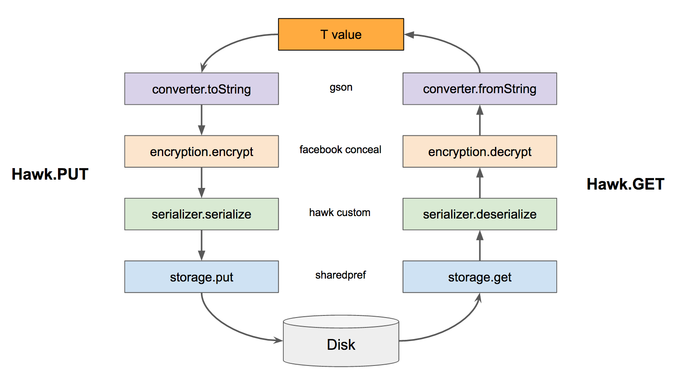

# Hawk

Simple, pluggable key-value storage for Android. Save a value with a key and read it back without writing a database schema.

- Store primitives, strings, custom objects, lists, sets, and maps.
- Persist values in app-private SharedPreferences.
- Customize parsing, conversion, encryption, serialization, and storage.
- Check, count, and delete entries through a small API.

## Install

Use Maven Central and the available release:

```kotlin
repositories {
    mavenCentral()
}

dependencies {
    implementation("com.orhanobut:hawk:2.0.1")
}
```

The examples below use APIs available in 2.0.1. The next version is unreleased and requires Android 5.0 (API 21) or newer; the published 2.0.1 artifact declares API 10 as its minimum.

## Quick start

Initialize once using an application context, before reading or writing:

```kotlin
Hawk.init(applicationContext).build()

val saved = Hawk.put("name", "Ada")
val name: String? = Hawk.get("name")
val visits: Int = Hawk.get("visits", 0)

Hawk.put("tags", listOf("android", "kotlin"))
val tags: List<String>? = Hawk.get("tags")

Hawk.contains("name")
Hawk.count()
Hawk.delete("name")
Hawk.deleteAll()
```

`put` returns whether the value was saved. Passing a null value deletes the key. A missing key returns null, or the supplied default. `deleteAll` clears stored values but retains encryption keys. Reads and writes are synchronous; perform substantial work away from the main thread.

## Configuration

Gson is the default parser. Supply a configured parser for custom type adapters, or replace any pipeline interface with your own implementation:

```kotlin
Hawk.init(applicationContext)
    .setParser(GsonParser(GsonBuilder().create()))
    .setStorage(myStorage)
    .setEncryption(myEncryption)
    .build()
```

`NoEncryption()` is available for data that needs no confidentiality. It only Base64-encodes values.

## Compatibility and limitations

Hawk's default encryption uses Facebook Conceal, an archived native library. If Conceal cannot initialize, Hawk falls back to `NoEncryption`. Applications requiring encryption must supply and validate an encryption implementation rather than rely on this fallback. Keys are kept in app-private preferences, not the Android Keystore. Avoid logging sensitive data through a `LogInterceptor`.

Conceal's native binaries do not meet current 16 KB page-alignment requirements. Treat support for 16 KB Android devices and current Play submission requirements as unresolved, including in the unreleased version. See [Android's page-size guidance](https://developer.android.com/guide/practices/page-sizes).

Use the same type when reading a key as when saving it. Collections record the first element's class, so use homogeneous, non-nested collections whose first element (and first map key/value) is non-null. Model changes can prevent older data from being read. Gson does not enforce Kotlin constructor defaults or non-null properties.

For apps using R8, keep the names and fields of models persisted with Hawk: the format stores class names and Gson uses reflection. For example, with your own package:

```proguard
-keep class com.example.app.storage.model.** { *; }
```

Changing encryption, parsing, or storage implementations does not migrate existing data. Hawk 2 data is incompatible with Hawk 1.

## How values are stored



## License

[Apache License 2.0](LICENSE). Copyright Orhan Obut.
